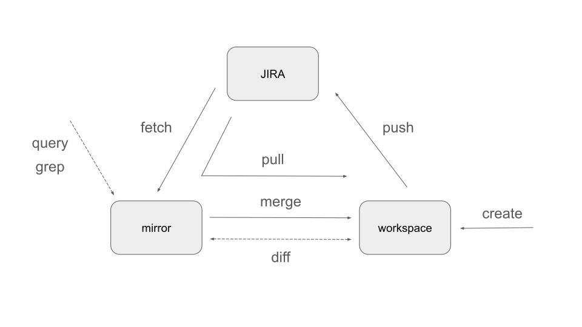

# tkt - JIRA Ticket CLI Tool

tkt is a command-line tool that allows you to **pull JIRA tickets, edit them locally as Markdown, and push changes back**. Work with JIRA tickets using your favorite text editor and tools!

## Key Features

- 📝 **Local Editing**: Edit JIRA tickets as plain Markdown files with YAML frontmatter
- 🔄 **Bidirectional Sync**: Fetch tickets from JIRA and push changes back
- 🔍 **Full-text Search**: Search through ticket content using grep-like functionality
- 📊 **SQL Queries**: Query ticket metadata using SQL syntax
- 🎯 **Diff Support**: View differences between local and remote versions

## Workflow Overview



The core workflow is simple:

1. **pull** - Download JIRA tickets as Markdown files
2. **edit** - Modify tickets locally using any text editor
3. **push** - Sync changes back to JIRA

## Installation

```bash
go install github.com/qawatake/tkt/cmd/tkt@latest
```

## Quick Start

### 1. Set up JIRA API Token

First, create a JIRA API token at https://id.atlassian.com/manage-profile/security/api-tokens and set it as an environment variable:

```bash
export JIRA_API_TOKEN=your_token_here
```

### 2. Initialize Configuration

```bash
tkt init
```

This creates a `tkt.yml` configuration file in your current directory with your JIRA server details and authentication.

### 3. Pull Tickets

```bash
tkt pull
```

Downloads JIRA tickets as Markdown files to `./tmp/` (configurable).

### 4. Edit Locally

Open and edit the Markdown files in your preferred editor. Each ticket includes:

```markdown
---
key: PRJ-123
status: In Progress
assignee: qawatake@example.com
summary: Fix authentication bug
---

# PRJ-123: Fix authentication bug

## Description

The authentication system has a bug that prevents users from logging in...

## Acceptance Criteria

- [ ] Users can log in successfully
- [ ] Error messages are clear
```

### 5. Push Changes

```bash
tkt push
```

Syncs your local changes back to JIRA.

## Advanced Features

### SQL Queries

Query ticket metadata interactively using SQL syntax:


```bash
tkt query
```

### Full-text Search

Search through ticket content interactively:


```bash
tkt grep
```

### Diff Tracking

View differences between local and remote versions (similar to git diff):

```bash
tkt diff
```

## Commands

- `tkt init` - Initialize configuration in current directory
- `tkt fetch` - Download JIRA tickets as Markdown files
- `tkt pull` - Download JIRA tickets as Markdown files (fetch + merge)
- `tkt push` - Upload local changes to JIRA
- `tkt diff` - Show differences between local and remote (like git diff)
- `tkt merge [ticket]` - Merge remote changes with local edits
- `tkt query` - Interactive SQL queries for ticket metadata
- `tkt grep` - Interactive full-text search through ticket content


